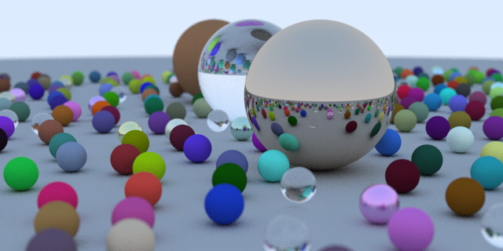

# Ray Tracing in One Weekend

This is a simple Rust implementation of [Peter Shirley's “Ray Tracing in One Weekend.”](https://raytracing.github.io/books/RayTracingInOneWeekend.html)



Compared to the original C++ version this version
- Has a slightly nicer scene (fewer intersections/collisions and no floating spheres)
- Doesn't contain oodles of memory leaks 😉 (Rust memory safety FTW)
- Writes a binary BMP instead of an ASCII PPM, because text formats are never the right choice IMNSHO
- Has some simple parallelization using [rayon](https://github.com/rayon-rs/rayon) via [ndarray](https://github.com/rust-ndarray/ndarray)
- Uses external crates such as [nalgebra](https://github.com/rustsim/nalgebra) for `Vec3` and has fewer roll-your-own data structures in general

Compared to other Rust versions [[1](https://github.com/Nelarius/weekend-raytracer-rust), [2](https://github.com/ranveeraggarwal/rust-raytracer)] I chose to stick closer to the C++ original in that the code uses trait objects for runtime polymorphism instead of enums, i.e., my list of hittables is a
```rust
Vec<Box<dyn Hittable + Sync>>
```
instead of a
```rust
Vec<Sphere>
```
and the material reference in the `Sphere` object is an
```rust
Arc<dyn Material + Send + Sync>
```
instead of something like
```rust
pub enum Material {
	Lambertian(Lambertian),
	Metal(Metal),
	Dielectric(Dielectric),
}
```
where the `Send` and `Sync` constraints are for parallelization.
The choice to use trait objects was mainly because this was an exercise in using Rust's trait objects for me 😄.

There is currently one line of `unsafe` code in here, probably because I used [rayon](https://github.com/rayon-rs/rayon)/[ndarray](https://github.com/rust-ndarray/ndarray) incorrectly.
Suggestions are welcome.
